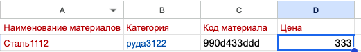

# Приложение для создания справочника

Справочник включает в себя список материалов и дерево категорий материалов.


## Установка

1. Клонируйте репозиторий:

   ```
   git clone git@github.com:EgorIvanov96/directory.git
   cd ваш_репозиторий
   ```

2. Создайте и активируйте виртуальное окружение:

   ```
   python -m venv venv
   source venv/bin/activate  # на Windows используйте venv\Scripts\activate
   ```

3. Установите необходимые зависимости:

   ```
   pip install -r requirements.txt
   ```

4. Выполните миграции базы данных:

   ```
   python manage.py migrate
   ```

5. Создайте суперпользователя, чтобы получить доступ к админке:

   ```
   python manage.py createsuperuser
   ```


## Запуск

Запустите сервер разработки:

```
python manage.py runserver
```

## Запуск через docker-compose.yml

1. Установите Docker

2. Перейдите в корневую папку проекта

4. Запустите файл docker-compose.yml

```
   docker compose up --build
```

5. После запуска контейнеов запустите иаграции:

```
docker-compose exec web python manage.py migrate
```

5. Также можете создать  суперпользователя для панели администратора Django:
```
docker-compose exec web python manage.py createsuperuser
```

6. Приложение ГОТОВО к работе

Теперь вы можете получить доступ к API по адресу `http://localhost:8000/api/`


## Использование API

### Регистрация пользователя

- **POST** `/api/users/`
- Данные:
  ```json
  {
    "email": "example@example.com",
    "username": "your_username"
  }
  ```

### Категории 

- Список категорий 
- **GET** `/api/categories/`

- Создание новой категории
- **POST** `/api/categories/`
```json
{
    "name_categories": "руда3122",
    "category_code": "784-949v443v22"
}
```

- Удаление категории
- **DELETE** `/api/categories/id/`

### Дерево категорий материалов

- **GET**  `api/treecategory/`

### Материалы

- Список материалов
- **GET** `/api/materials/`

- Создание нового материала
- **POST** `/api/materials/upload/` + прикрепить файл с расширением xlsx


- Обновление материала
- **PUT** `/api/materials/id/`
```json
{
    "name_materials": "Сталь10", # меняем данные
    "categories_materials": "3", # меняем данные
    "materials_code": "1", # меняем данные
    "price": 100 # меняем данные
}
```

- Удаление материала
- **DELETE**  `/api/materials/id/`
